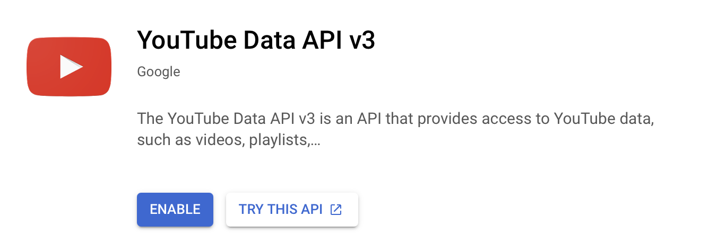
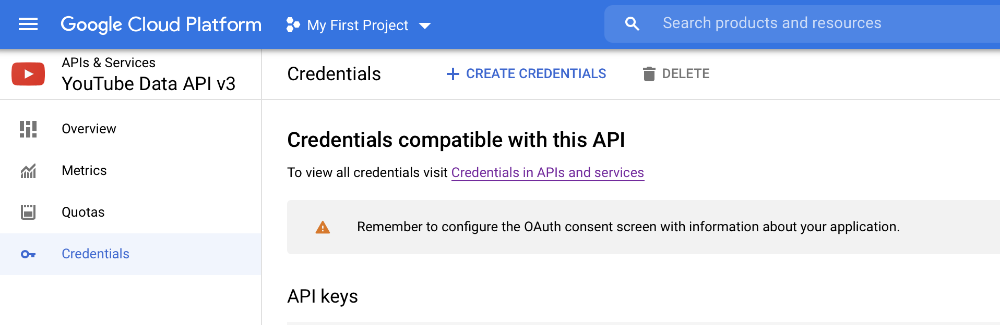

# YouTube infinite scroll

This demo uses [SQLModel](https://sqlmodel.tiangolo.com/) and [htmx](https://htmx.org/) to generate an [infinite scroll](https://htmx.org/examples/infinite-scroll/) of videos of a YouTube videos.

## Setup

Make a virtual environment and install the requirements:

```
$ make install
python3.9 -m venv venv && source venv/bin/activate && pip install -r requirements-dev.txt
```

Then go to [Google Cloud Platform > YouTube Data API v3](https://console.cloud.google.com/apis/library/youtube.googleapis.com?project=top-repos) and hit the blue ENABLE button, then generate your API key:





Next set up your `.env` file:

```
cp .env-example .env
```

Populate it with the following environment variables:

- `YT_CHANNEL`: the YouTube channel to use this on, to try it out with PyBites you can use `UCBn-uKDGsRBfcB0lQeOB_gA` or for PyCon use `UCMjMBMGt0WJQLeluw6qNJuA` (demo below).

- `YOUTUBE_API_KEY`: the API key you just created.

- `DATABASE_URL`: create a database and point to it (in case of `sqlite` all you need to do is specify one like this: `sqlite:///db.sqlite3`)

Next let's cache the YouTube channel's data (all videos' metadata) to not exhaust the YouTube API rate limit.

Run the following command with your virtual environment enabled (this example uses PyCon's YouTube channel):

```
$ make dbsetup
source venv/bin/activate && python -m youtube.db
Total records: 172 (newly inserted: 172)
```

Result:


Lastly run the app:

```
make run
```

Navigate to [localhost:8000](http://localhost:8000/) and you should see something like this:


